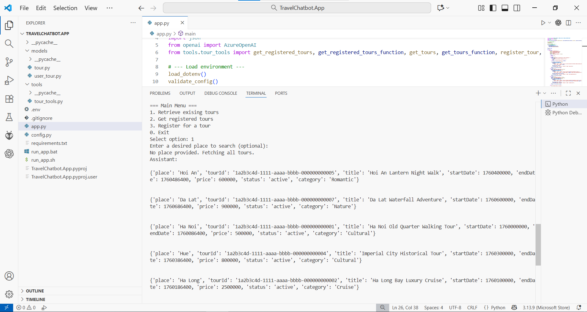
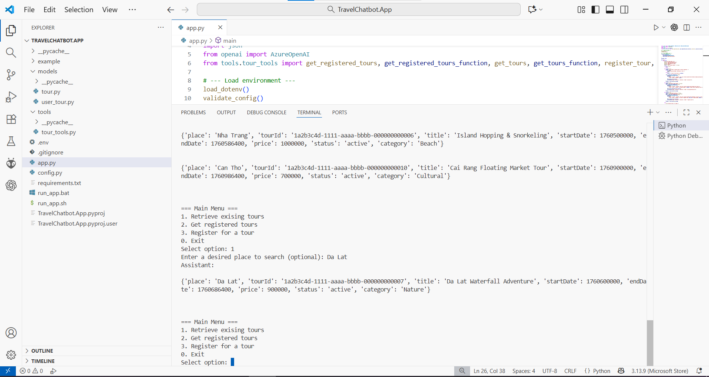
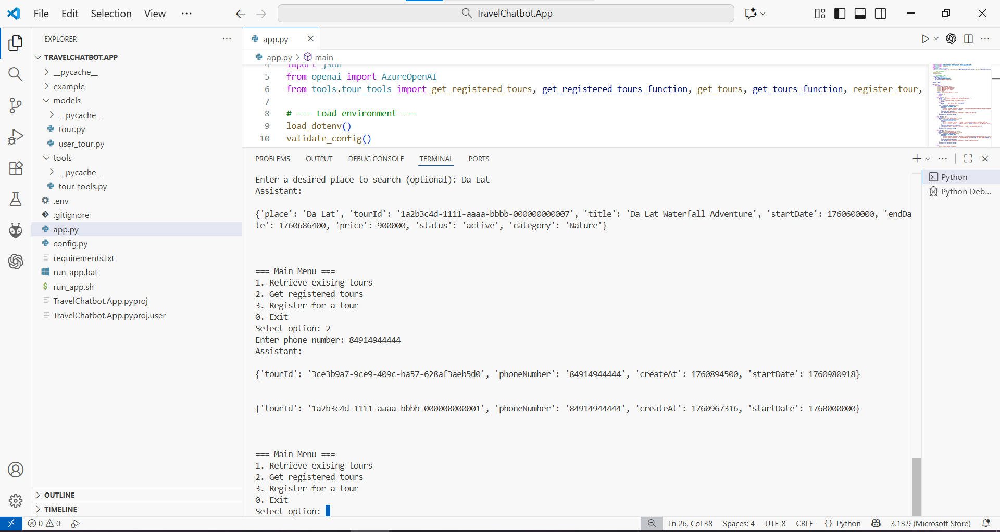
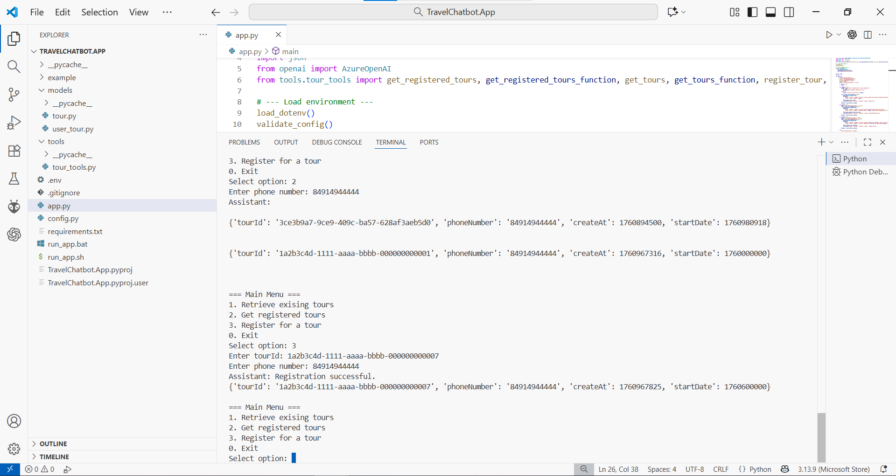

# TravelChatbot.App

Lightweight CLI travel assistant that integrates Azure OpenAI and AWS DynamoDB to:
- list available tours,
- show a user's registered tours, and
- register a user for a tour.

This repo contains:
- app.py — simple CLI that talks with Azure OpenAI and invokes local tool functions,
- tools/tour_tools.py — DynamoDB helpers (get_tours, get_registered_tours, register_tour),
- models/ — data models (e.g. UserTour),
- example/ — example result images (see below).

---

## Requirements

- Python 3.10+
- AWS credentials with DynamoDB access
- Azure OpenAI deployment + key
- Packages:
  - boto3
  - botocore
  - python-dotenv
  - openai (Azure OpenAI client provided in project)
  - (install via pip)

Example:
```bash
python -m pip install boto3 botocore python-dotenv openai
```

---

## Environment variables

Create a `.env` file (project reads via python-dotenv). Required keys:

- AWS_ACCESS_KEY_ID
- AWS_SECRET_ACCESS_KEY
- AWS_REGION
- OPENAI_ENDPOINT
- OPENAI_API_KEY
- OPENAI_DEPLOYMENT_NAME

The project includes `config.validate_config()` — ensure the variables are set before running.

---

## DynamoDB expected tables & indexes

The code expects two DynamoDB tables with these logical shapes:

1. Tours (table name: `Tours`)
   - Primary key: partition `place` (used by scan/query by place)
   - Global Secondary Index: `tourId-index` with partition key `tourId` (used to lookup tour by tourId)
   - Stored attributes expected on items: `tourId` (S), `place` (S), `startDate` (N), ...others

2. UserTours (table name: `UserTours`)
   - Primary key layout used by code: partition `tourId`, sort `phoneNumber` (the code queries with KeyConditionExpression "tourId = :t AND phoneNumber = :p")
   - GSI: `phoneNumber-createAt-index` with partition key `phoneNumber` and sort key `createAt` (used to fetch a user's registered tours sorted by createAt)
   - Stored attributes expected: `tourId` (S), `phoneNumber` (S), `createAt` (N), `startDate` (N)

Adjust table schemas/indexes accordingly if you create the tables manually.

---

## Usage

Run the CLI:

```powershell
# Windows
python app.py
```

Menu options:
1. Retrieve existing tours — optionally enter a place to filter.
2. Get registered tours — enter phone number to list registrations.
3. Register for a tour — provide `tourId` and phone number. The program:
   - looks up the tour by `tourId` using `tourId-index`.
   - if not found => displays Assistant: tour not found
   - checks UserTours for an existing registration (tourId + phoneNumber)
   - if exists => displays Assistant: tour is registered
   - otherwise writes a new item to `UserTours` with `createAt` (epoch) and `startDate` copied from the Tours item.

Errors from AWS are displayed back with the Assistant role (try/catch in app.py).

---

## Implementation notes

- Tools are defined to permit the Azure OpenAI function-style tool calling:
  - get_tours_function
  - get_registered_tours_function
  - register_tour_function
- DynamoDB interactions are implemented using boto3 low-level client; attribute value types are explicit (S / N).
- Time for createAt uses `int(time.time())` (epoch seconds).

---

## Example results / images

The `example/` folder includes several sample output images produced by the app. To view them, open the files in your image viewer or in VS Code explorer:
- d:\Save\TravelRecommender\TravelChatbot.App\example\

  Retrieve tours (all):
  

  Retrieve tours with place search:
  

  Get registered tours by phone number:
  

  Register for a tour:
  


---

## Troubleshooting

- AWS permission issues: verify IAM credentials can access DynamoDB and that the table names and index names match those expected in code.
- Index or attribute errors: confirm the DynamoDB item attribute types (S/N) match code expectations.
- Azure OpenAI issues: confirm endpoint, API key and deployment name are valid and the API version aligns with the client library in use.

---

## Contributing

Small project — open issues or send PRs for fixes or feature suggestions.

---

## License

MIT (or choose your preferred license).

```// filepath: d:\Save\TravelRecommender\TravelChatbot.App\README.md

# TravelChatbot.App

Lightweight CLI travel assistant that integrates Azure OpenAI and AWS DynamoDB to:
- list available tours,
- show a user's registered tours, and
- register a user for a tour.

This repo contains:
- app.py — simple CLI that talks with Azure OpenAI and invokes local tool functions,
- tools/tour_tools.py — DynamoDB helpers (get_tours, get_registered_tours, register_tour),
- models/ — data models (e.g. UserTour),
- example/ — example result images (see below).

---

## Requirements

- Python 3.10+
- AWS credentials with DynamoDB access
- Azure OpenAI deployment + key
- Packages:
  - boto3
  - botocore
  - python-dotenv
  - openai (Azure OpenAI client provided in project)
  - (install via pip)

Example:
```bash
python -m pip install boto3 botocore python-dotenv openai
```

---

## Environment variables

Create a `.env` file (project reads via python-dotenv). Required keys:

- AWS_ACCESS_KEY_ID
- AWS_SECRET_ACCESS_KEY
- AWS_REGION
- OPENAI_ENDPOINT
- OPENAI_API_KEY
- OPENAI_DEPLOYMENT_NAME

The project includes `config.validate_config()` — ensure the variables are set before running.

---

## DynamoDB expected tables & indexes

The code expects two DynamoDB tables with these logical shapes:

1. Tours (table name: `Tours`)
   - Primary key: partition `place` (used by scan/query by place)
   - Global Secondary Index: `tourId-index` with partition key `tourId` (used to lookup tour by tourId)
   - Stored attributes expected on items: `tourId` (S), `place` (S), `startDate` (N), ...others

2. UserTours (table name: `UserTours`)
   - Primary key layout used by code: partition `tourId`, sort `phoneNumber` (the code queries with KeyConditionExpression "tourId = :t AND phoneNumber = :p")
   - GSI: `phoneNumber-createAt-index` with partition key `phoneNumber` and sort key `createAt` (used to fetch a user's registered tours sorted by createAt)
   - Stored attributes expected: `tourId` (S), `phoneNumber` (S), `createAt` (N), `startDate` (N)

Adjust table schemas/indexes accordingly if you create the tables manually.

---

## Usage

Run the CLI:

```powershell
# Windows
python app.py
```

Menu options:
1. Retrieve existing tours — optionally enter a place to filter.
2. Get registered tours — enter phone number to list registrations.
3. Register for a tour — provide `tourId` and phone number. The program:
   - looks up the tour by `tourId` using `tourId-index`.
   - if not found => displays Assistant: tour not found
   - checks UserTours for an existing registration (tourId + phoneNumber)
   - if exists => displays Assistant: tour is registered
   - otherwise writes a new item to `UserTours` with `createAt` (epoch) and `startDate` copied from the Tours item.

Errors from AWS are displayed back with the Assistant role (try/catch in app.py).

---

## Implementation notes

- Tools are defined to permit the Azure OpenAI function-style tool calling:
  - get_tours_function
  - get_registered_tours_function
  - register_tour_function
- DynamoDB interactions are implemented using boto3 low-level client; attribute value types are explicit (S / N).
- Time for createAt uses `int(time.time())` (epoch seconds).

---

## Example results / images

The `example/` folder includes several sample output images produced by the app. To view them, open the files in your image viewer or in VS Code explorer:
- d:\Save\TravelRecommender\TravelChatbot.App\example\

(If images do not appear in the repository view, ensure your IDE file filters are not hiding them.)

---

## Troubleshooting

- AWS permission issues: verify IAM credentials can access DynamoDB and that the table names and index names match those expected in code.
- Index or attribute errors: confirm the DynamoDB item attribute types (S/N) match code expectations.
- Azure OpenAI issues: confirm endpoint, API key and deployment name are valid and the API version aligns with the client library in use.

---
